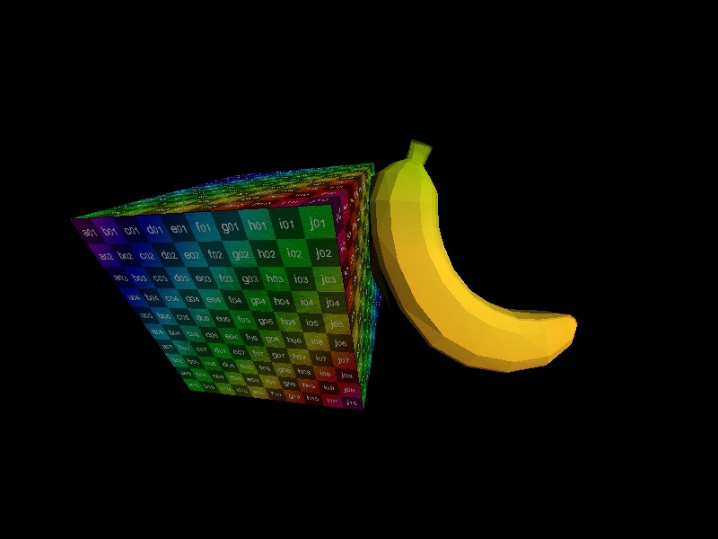
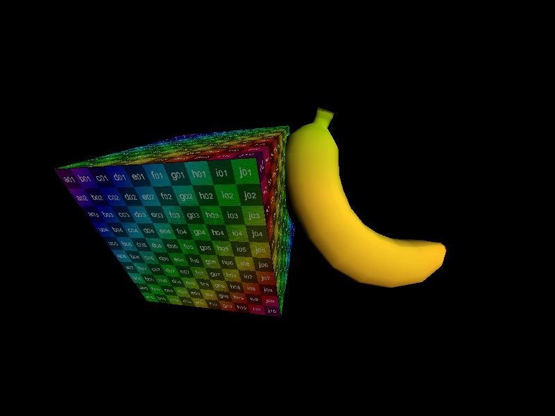

## Простой софтверный рендер

* Для вывода на экран используется ddraw.
* Текстуры загружаются с помощью stb_image.
***
### Плоское затенение

    class FlatShader : public ssr::abstrctShader
    {
    public:
    	virtual ~FlatShader() {};
    ssr::point3D vertex(const ssr::face& f, const int& idx) override
    {
		text_coord[0][idx] = f.v[idx].vt.x;
		text_coord[1][idx] = f.v[idx].vt.y;

		ssr::vector<4> v = { f.v[idx].coord.x, f.v[idx].coord.y, f.v[idx].coord.z, 1. };
		vert[idx] = projection * (to_world * v);
		if (idx == 2)
		{
			auto AB = vert[1] - vert[0]; auto AC = vert[2] - vert[0];
			auto normal = ssr::cross({ AB[0], AB[1], AB[2] }, { AC[0], AC[1], AC[2] });
			intensity = ssr::dot(normal.normalize(), directional_light.normalize());
		}
		return vert[idx];
	};

	ssr::color pixel(const ssr::point3D& bar, ssr::Texture* t) override
	{
		ssr::color c;
		if (intensity < 0.)
		{
			c.ARGB = 0xFF000000;
		}
		else
		{
			auto uv = text_coord * bar;
			c = t->getPixel(uv.x, uv.y);
			c.B *= intensity; c.R *= intensity; c.G *= intensity;
		}
		return c;
	};

    protected:
	    ssr::matrix<2, 3> text_coord;
	    ssr::matrix<3, 3> vert;
	    double intensity{ 0. };
    };
### Затенение Гуро (Фонга)

    class GouraudShader : public ssr::abstrctShader
    {
    public:
	    virtual ~GouraudShader() {};

	ssr::point3D vertex(const ssr::face& f, const int& idx) override
	{
		text_coord[0][idx] = f.v[idx].vt.x;    text_coord[1][idx] = f.v[idx].vt.y;

		ssr::vector<4> n4 = { f.v[idx].vn.x, f.v[idx].vn.y, f.v[idx].vn.z, 0. };
		ssr::vector<3> n = projection * (to_world * n4);

		normals[0][idx] = n.x;    normals[1][idx] = n.y;    normals[2][idx] = n.z;

		ssr::vector<4> v = { f.v[idx].coord.x, f.v[idx].coord.y, f.v[idx].coord.z, 1. };
		return projection * (to_world * v);
	};

	ssr::color pixel(const ssr::point3D& bar, ssr::Texture* t) override
	{
		auto n = normals * bar;
		double intensity = ssr::dot(n.normalize(), directional_light.normalize());
		ssr::color c;
		if (intensity < 0.)
		{
			c.ARGB = 0xFF000000;
		}
		else
		{
			ssr::point2D uv = text_coord * bar;
			c = t->getPixel(uv.x, uv.y);
			c.R *= intensity; c.G *= intensity; c.B *= intensity;
		}
		return c;
	};
    protected:
	    ssr::matrix<2, 3> text_coord;
	    ssr::matrix<3, 3> normals;
    };
### Затенение Фонга

    class PhongShader : public ssr::abstrctShader
    {
    public:
	    virtual ~PhongShader() {};

	ssr::point3D vertex(const ssr::face& f, const int& idx) override
	{
		text_coord[0][idx] = f.v[idx].vt.x;    text_coord[1][idx] = f.v[idx].vt.y;

		ssr::vector<4> n4 = { f.v[idx].vn.x, f.v[idx].vn.y, f.v[idx].vn.z, 0. };
		ssr::vector<3> n = projection * (to_world * n4);

		normals[0][idx] = n.x;    normals[1][idx] = n.y;    normals[2][idx] = n.z;

		ssr::vector<4> v = { f.v[idx].coord.x, f.v[idx].coord.y, f.v[idx].coord.z, 1. };
		return projection * (to_world * v);
	};

	ssr::color pixel(const ssr::point3D& bar, ssr::Texture* t) override
	{
		auto n = normals * bar;
		double diffuse = max(0., ssr::dot(n.normalize(), directional_light.normalize()) );
		ssr::color c;
		if (diffuse == 0.)
		{
			c.ARGB = 0xFF000000;
		}
		else
		{
			auto r = 2 * n * diffuse - directional_light;
			double specular = ssr::dot(r.normalize(), { 0.,0.,1. });
			double intensity = 0.9 * diffuse + 0.3 * pow(specular, 100.);

			ssr::point2D uv = text_coord * bar;
			c = t->getPixel(uv.x, uv.y);
			c.R = min(255, intensity * c.R);  c.G = min(255, intensity * c.G);  c.B = min(255, intensity * c.B);
		}

		return c;
	};
    protected:
	    ssr::matrix<2, 3> text_coord;
	    ssr::matrix<3, 3> normals;
    };
